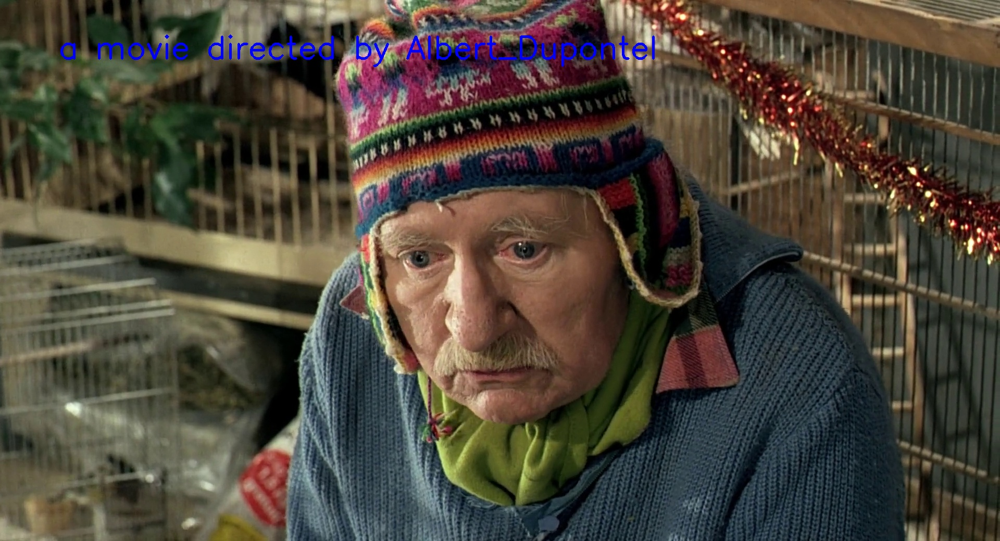
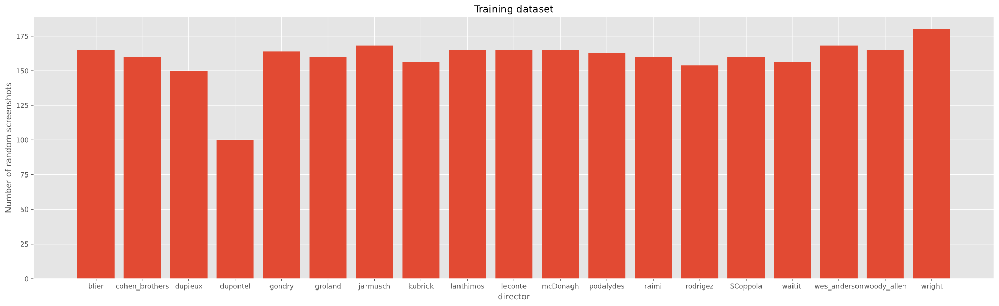
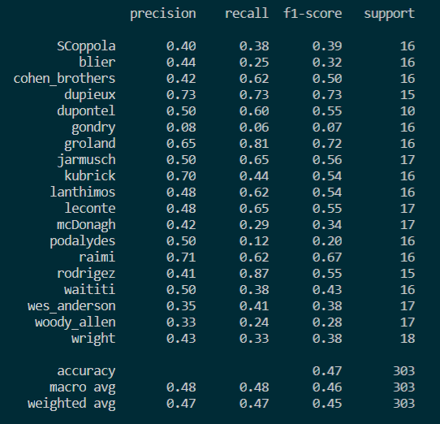

# Recognize the film's director based on a screenshot

The idea behind this program is to have a machine learning model which is able to recognize who the director of a movie is, based on a single screenshot.



In fact, a lot of directors can be guessed just by looking at a single shot as they work on their aesthetic with recognisable features : colors, contrasts, aspect ratios, perspectives, and even shot composition or recurent actors. One can think of Wes Anderson, Jean-Pierre Jeunet, Quentin Tarantino, Yorgos Lanthimos, Woody Allen, and many many many others... 
Maybe a machine learning model can identify those features in a single screenshot, and thus predit who the director of the movie is.

This repository contains:
* a model_builder.py file which defines some useful classes for the training script,
* a data_extractor.py file which defines a class to help to user extract screenshots from a video,
* a fine_tune_resnet.py file to train the last layer of resnet (all the other weights are frozen) to classify our directors,
* a director_guesser.py file to apply our model to images,
* a data_explorer.ipynb notebook to plot informations about the user's training dataset,
* a config.py file to store needed data.

To use this program, the user must firstly install the needed libraries with the command line:
```sh
$ pip install -r requirements.txt
```

## First tests

I managed to generate random screenshots from movies to fill my training dataset, using the data_extractor.py script, which is to be adapted for the user's movie storage. Here are some informations about my dataset, plotted with the data_explorer.ipynb notebook:



It is quite balanced (except for Albert Dupontel, sorry...) but there are still not enough data to train (a little 3024 files) and after 200 Epochs of a first training, I get the following results:

<p align="center">

</p>

Moreover, if the number of files for each director seems balanced, the number of movies for each director is not: I may have had to generate fifty screenshots from two films directed by A and ten screenshots from ten films directed by B...

## Training process

In order to train the model, one must have...some data !
It must the biggest challenge of this project : to gather enough data to determine who directed which movie. As each movie is unique even for a same director, and there are a lot of characteristics to identify in order to guess who the director is, the best way of gathering data seems to be the generation of lots of random screenshots from one movie, for a lots of movies.

*For the moment, I decided to fine-tune the ResNet model, as it is pretty efficient on image classification problems and requires less data than a full training.*

### Data organisation

Those data must be in a directory that the user defines in the config.py file with the `TRN_DIR` variable. For the training script to obtain labels of the testing images, the screenshots from one director have to be placed inside a folder named after the director (the screenshots' names are not important).

To help the user gathering data, I created a class in data_extractor.py for one to import a video, choose a frame to freeze, and save it directly inside the right directory. The used video are to be placed inside a directory indicated in the config.py file (`SRC_DIR`).

### Script usage

In a python terminal, use the command line:
```sh
$ python fine_tune_resnet.py
```

There is an optionnal arguments: 
* `--plot path/to/plot/visualization`

and one can find its usage using the command line:
```sh
$ python fine_tune_resnet.py --help
```
(spoiler : it indicates the path to plot training statistics !)

Some parameters are stored in the config.py, where the user can set :
* the generated test dataset size (in percentages),
* the learning rate (for optimization purpose),
* the number of epochs,
* the batch size.

## Play with the model

To apply the model to a chosen screenshot, the user can use this command line:
```sh
$ python director_guesser.py --image path/to/image/to/test
```
There is an optionnal arguments: 
* `--save path/to/save/prediction`

and one can find its usage using the command line:
```sh
$ python director_guesser.py --help
```
(spoiler again : it indicates the path to save the prediction if the user wants to.)

### Predicted names

Of course, the model can't predict a director he's never seen, so the range of names depends on the range of names one trained the model with.

## Pre-trained model and data gathering

I tested those scripts on a very simple dataset I generated by the use of the data_extractor.py with my own movie library. Of course, as a result, the model is quite poor and works badly (but the scripts does work correctly !).

Moreover, I do not have any permission to gather data from professionnal movies and I do not know anything about having the right to share screenshots, so I wont share my database here (I plan on growing it a little bit).